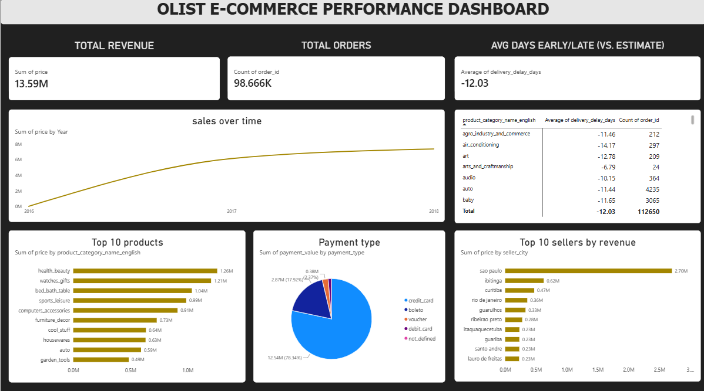

# E-Commerce ETL Pipeline

An end-to-end ETL pipeline built on the Olist Brazilian E-Commerce public dataset — transforming raw multi-table CSVs into a star schema warehouse on PostgreSQL (hosted on Neon), with a Power BI dashboard for business-facing analysis.



## Stack
Python (pandas, SQLAlchemy) · PostgreSQL (Neon, cloud-hosted) · Power BI · Git

## Architecture

Extract → 9 raw CSVs loaded into Postgres staging tables (unclean, as-is)
Transform → pandas: dedup, null handling, date parsing, derived fields, data quality logging
Load → bulk temp-table upserts into a star schema (idempotent, safely rerunnable)
Orchestrate → pipeline.py runs extract → transform → load end-to-end, with full audit logging
Visualize → Power BI dashboard connected directly to the warehouse


## Star schema

The grain of the core fact table is **one row per product per order** (`fact_order_items`). Payments and reviews have their own natural grain, so they're modeled as separate fact tables rather than forced into the same row.

| Table | Type | Grain |
|---|---|---|
| `dim_customers` | Dimension | One row per customer |
| `dim_products` | Dimension | One row per product |
| `dim_sellers` | Dimension | One row per seller |
| `dim_date` | Dimension | One row per calendar day (2016–2018) |
| `fact_order_items` | Fact | One row per product per order |
| `fact_payments` | Fact | One row per payment (orders can split across multiple payment methods) |
| `fact_reviews` | Fact | One row per review |
| `pipeline_run_log` | Audit | One row per pipeline stage per run |

## Data quality decisions

- **~2,900 orders with missing delivery/approval dates** were kept, not dropped — these correlate with cancelled or in-transit orders, and `order_status` explains the nulls rather than treating them as errors.
- **610 products missing category data** were kept and labeled `'unknown'` rather than discarded, since real pipelines rarely get to throw away 2% of the catalog.
- **814 duplicate review IDs** were deduplicated during transform, logged and tracked in `pipeline_run_log`.
- **Delivery delay** is computed as `delivered_date − estimated_date`. Interestingly, the dataset average is **negative** (~−12 days) — Olist's estimated delivery dates are conservatively padded, so most orders arrive well ahead of the promised date. This is reflected in the dashboard as "Avg Days Early/Late (vs. Estimate)" rather than a raw delay figure, since a negative number without context reads as an error.

## Design notes

- The pipeline is **idempotent** — reruns safely upsert rather than duplicate, verified by rerunning the full pipeline multiple times against both local and cloud databases with no data corruption or duplication.
- Initial cloud loads used row-by-row upserts, which were far too slow over network latency to a remote database (20+ minutes, with dropped-connection failures). Switched to a **bulk temp-table pattern** — `to_sql` bulk insert into a temp table, followed by a single server-side `INSERT ... SELECT ... ON CONFLICT` — cutting load time to under a minute.
- `pipeline_run_log` gives a real audit trail: every extract/transform/load run is logged with row counts and rejection counts per table, not just console output.
- Database migrated from local PostgreSQL to Neon (managed cloud Postgres) to support building the dashboard in Power BI Desktop (Windows-only) from a separate machine than the one running the pipeline.

## Dashboard

The Power BI dashboard ("Olist E-Commerce Performance Dashboard") includes:
- **KPI row:** Total Revenue, Total Orders, Avg Days Early/Late (vs. Estimate)
- **Sales over time** — revenue trend, 2016–2018
- **Delivery performance by product category** — average delay and order count per category
- **Top 10 products by revenue**
- **Payment type breakdown** — share of revenue by payment method
- **Top 10 sellers by revenue**

## Project structure

ecommerce-etl/
├── data/raw/ # source CSVs (gitignored)
├── schema.sql # star schema DDL
├── explore.py # initial data exploration script
├── generate_dim_date.py # populates dim_date
├── extract.py # Extract stage: raw CSVs → staging tables
├── transform.py # Transform stage: cleaning, dedup, derived fields
├── load.py # Load stage: bulk upserts into star schema
├── pipeline.py # orchestrates extract → transform → load
├── requirements.txt
├── .env.example
└── dashboard_screenshot.png


## Running it locally

```bash
python -m venv venv
source venv/bin/activate
pip install -r requirements.txt

# copy .env.example to .env and fill in your Postgres credentials

psql -d your_db -f schema.sql
python generate_dim_date.py
python pipeline.py
```

## Dataset

[Brazilian E-Commerce Public Dataset by Olist](https://www.kaggle.com/datasets/olistbr/brazilian-ecommerce) (Kaggle) — ~100K orders, 2016–2018, real anonymized data from a Brazilian marketplace.


